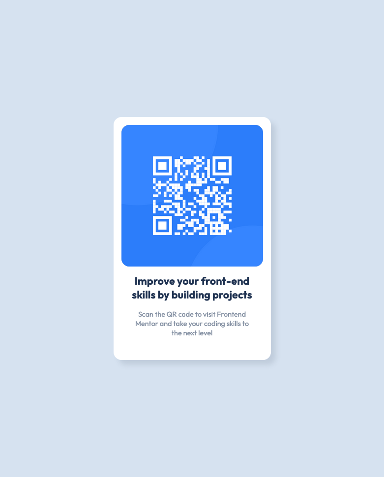

_# QR Code Card

Intégration de la carte QR Code.
Création du fichier html en respectant les classes utilisées dans le css.

## Colors

- White: hsl(0, 0%, 100%)

- Slate 300: hsl(212, 45%, 89%)
- Slate 500: hsl(216, 15%, 48%)
- Slate 900: hsl(218, 44%, 22%)

## Typography

### Font

- Family: [Outfit](https://fonts.google.com/specimen/Outfit)
- Weights: 400, 700
